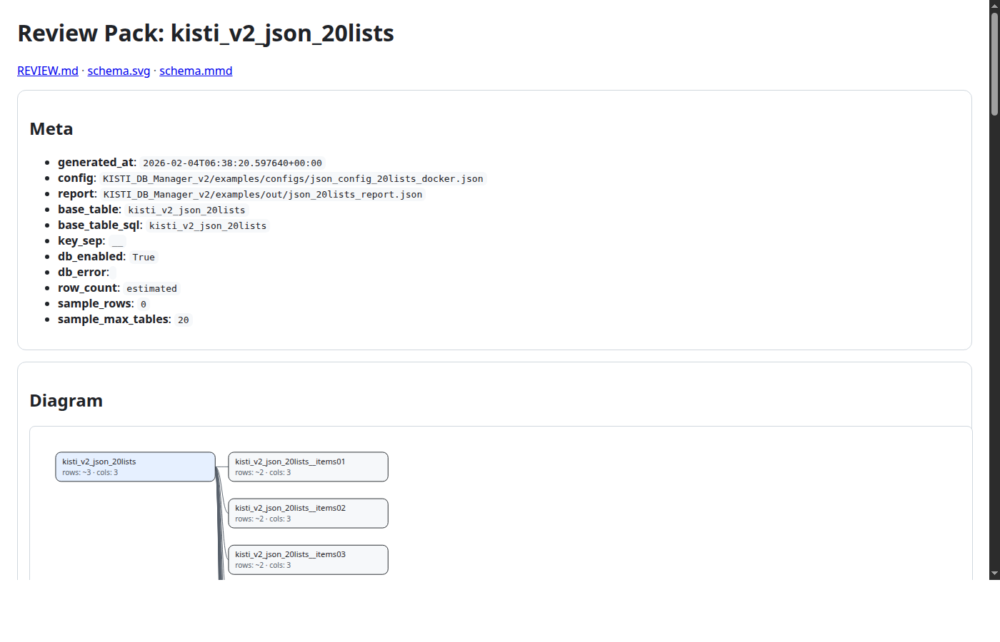

# Examples (smoke + previews)

## Run smoke test

Docker (recommended):

```bash
cd KISTI_DB_Manager/examples
docker compose up --build --abort-on-container-exit smoke
docker compose down
```

Host (requires deps + docker):

```bash
bash KISTI_DB_Manager/examples/smoke.sh
```

## Output previews

These are **representative snapshots**. Regenerate locally with the smoke test and check `KISTI_DB_Manager/examples/out/`.

### JSON 20-lists schema diagram


### Review HTML (rendered)



## Data_Sample schema (WoS)

We also ship a real-ish multi-table sample under `Data_Sample/` (repo root).

Generate/update the schema image:

```bash
python3 KISTI_DB_Manager/examples/generate_data_sample_schema.py
```

Result:


