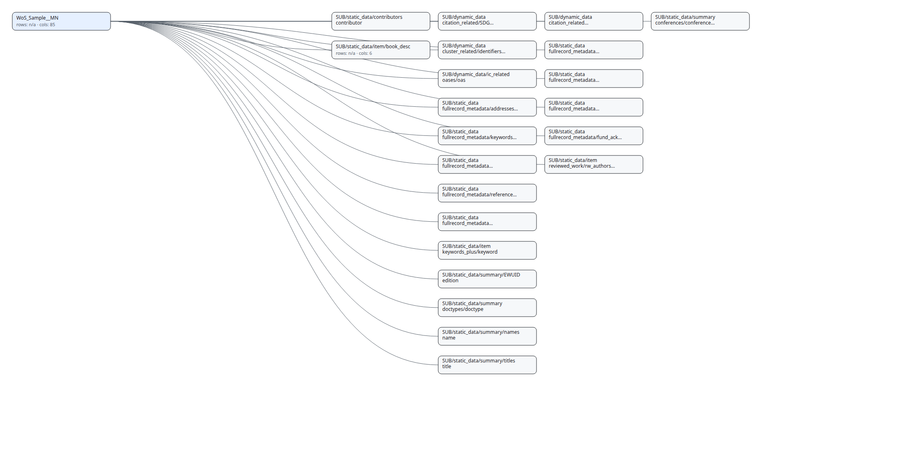

# KISTI_DB_Manager


MariaDB/MySQL handling utilities for preprocessing, import/export, and management.

## Versioning note (0.7.0)

Starting from **0.7.0**, this repository keeps a single implementation:
- **`KISTI_DB_Manager` is the “v2” codebase** (refactor + robustness + performance).
- The old v1-only implementation has been removed from the working tree (available in git history).

## Goals

- Keep the “never fail the whole run” philosophy for messy/heterogeneous data
- Make table/column naming constraints consistent across create/load/index steps
- Make large JSON/XML ingestion fast (bulk load + streaming) and observable (RunReport timings)

## What’s in the box

- **One-shot pipelines**
  - `tabular run`: Description → CREATE → LOAD → INDEX → OPTIMIZE
  - `json run`: records → flatten(main+subs) → CREATE/ALTER → LOAD → INDEX → OPTIMIZE
- **Schema drift handling**
  - New columns: best-effort `ALTER TABLE ADD COLUMN`
  - Insert failures: best-effort widen/add failing column (default `LONGTEXT`) and retry
  - Optional **schema freeze**: keep base schema stable and store unknown fields into `__extra__`
  - Excepted branches: preserve raw payload in excepted tables (`value`, `__except_raw_json__`, `__except_path__`, source context columns)
  - Optional **auto-except preflight**: random sample detects high-cardinality dict paths and appends them to `except_keys`
- **Performance**
  - `LOAD DATA LOCAL INFILE` fast path for bulk ingest (tabular + JSON streaming rows)
  - Chunk/batch controls, parallel JSON flattening, and stage timings/throughput in `RunReport`
- **Operational safety**
  - `RunReport` JSON + `Quarantine` JSONL for continue-on-error ingestion
- **Review/visualization**
  - Review pack generation (md/html/svg) and schema diagrams (optional extras)
  - HTML UI (search/depth/focus + SVG/PNG export) for `review pack` and `review diff`
  - Self-contained schema viewer HTML (`review schema-viewer`) with summary cards, logical groups, DDL preview, and searchable table catalog

## Schema visualization (Data_Sample)

Representative schema graph generated from `Data_Sample/`:



## Install

```bash
pip install -e .
```

Optional extras:

```bash
pip install -e ".[tabular]"
pip install -e ".[json]"
pip install -e ".[db]"
pip install -e ".[viz]"
pip install -e ".[review]"
pip install -e ".[json,db]"
pip install -e ".[json,db,viz,review]"
```

Recommended:
- Ingest only (tabular): `pip install -e ".[tabular,db]"`
- Ingest only (json/xml): `pip install -e ".[json,db]"`
- Full review/visualization: `pip install -e ".[json,db,viz,review]"`

If an extra is missing, CLI prints an install hint instead of a traceback.

## CLI

```bash
kisti-db-manager version
kisti-db-manager modes
kisti-db-manager report summary path/to/run_report.json
kisti-db-manager report diff path/to/before.json path/to/after.json --out diff.md
kisti-db-manager report profile path/to/run_report.json --top 10
kisti-db-manager quarantine summary path/to/quarantine.jsonl --out quarantine_out
kisti-db-manager review pack --config path/to/config.json --report run_report.json --out review_out
kisti-db-manager review schema-viewer --config path/to/config.json --report run_report.json --out schema_viewer_out
kisti-db-manager review diff path/to/before_review.json path/to/after_review.json --out-dir review_diff_out
kisti-db-manager review preview --config path/to/config.json --out preview_out  # raw vs flatten + union exceptions
kisti-db-manager tabular run --config path/to/config.json --report run_report.json --quarantine quarantine.jsonl
kisti-db-manager json run --config path/to/json_config.json --report json_report.json --quarantine quarantine.jsonl
```

Schema viewer notes:
- `review schema-viewer` writes `schema_viewer.html`, `schema_viewer.json`, `schema.svg`, and `schema.mmd`.
- With DB access it uses real table metadata; with `--no-db` it falls back to config/report-derived predicted schema.
- The HTML is self-contained and keeps the GoldenSet-style pattern: sticky nav, summary cards, inline SVG, logical depth groups, searchable table catalog, and DDL preview.

### Quick Start (JSON, large data)

Recommended 2-step flow:

```bash
# 1) ingest only (skip index/optimize)
kisti-db-manager json run --config path/to/json_config.json --mode ingest-fast

# 2) build indexes + optimize after ingest
kisti-db-manager json run --config path/to/json_config.json --mode finalize
```

If your goal is local parquet generation first, use an explicit parquet mode instead of relying on `default`:

```bash
# parquet-first with config-driven batch size/workers
kisti-db-manager json run --config path/to/json_config.json --mode parse-parquet

# parquet-first with conservative settings for large nested sources
kisti-db-manager json run --config path/to/json_config.json --mode parse-parquet-safe
```

If schema drift is heavy and ALTER is too expensive:

```bash
kisti-db-manager json run --config path/to/json_config.json --mode ingest-fast-freeze
```

If you want to capture most columns early, then cap ALTER churn later (hybrid):

```bash
kisti-db-manager json run --config path/to/json_config.json --mode ingest-fast-hybrid
```

For high-cardinality dict branches (for example OpenAlex `abstract_inverted_index`), run a preflight plan first and then ingest with `--auto-except`:

```bash
# 1) preflight: predicted schema + sample profile + auto-except candidates + ETA estimate
kisti-db-manager review plan \
  --config path/to/json_config.json \
  --auto-except \
  --auto-except-sample-records 5000 \
  --auto-except-sample-max-sources 64 \
  --out plan_out

# 2) ingest with auto-except enabled
kisti-db-manager json run \
  --config path/to/json_config.json \
  --mode ingest-fast \
  --auto-except
```

Notes:
- `excepted_expand_dict=false` (default) prevents excepted-table column explosion by storing nested payloads as JSON strings in `value`/`__except_raw_json__`.
- Tune detection thresholds if needed: `--auto-except-unique-key-threshold`, `--auto-except-min-observations`, `--auto-except-novelty-threshold`.
- Default JSON path is parquet-first: flattened batch files are saved under `runs/<table>_<run_id>/parquet` before DB load.
- Prefer explicit `parse-parquet*` or `ingest-fast*` modes for production runs; avoid relying on `default`.
- `ingest-fast*` modes remain direct insert-first/streaming modes for maximum throughput.
- `persist_parquet_files=true` and `json_streaming_load=true` are mutually exclusive and now fail fast at CLI validation time.

### Local Parquet Artifacts (default)

Default run behavior keeps flattened parquet artifacts on local disk before DB load:

```bash
kisti-db-manager json run \
  --config path/to/json_config.json
```

Change the parquet artifact directory explicitly:

```bash
kisti-db-manager json run \
  --config path/to/json_config.json \
  --persist-parquet-dir /path/to/local_parquet
```

Disable parquet persistence explicitly:

```bash
kisti-db-manager json run \
  --config path/to/json_config.json \
  --no-persist-parquet-files
```

Materialize persisted parquet artifacts into DB later (MVP helper script):

```bash
python scripts/oa_materialize_parquet_to_db.py \
  runs/<parse_parquet_run_dir> \
  --dotenv .env
```

Notes:
- This is a separate post-parse materialization step for `parse-parquet*` runs.
- It resumes from `runs/<parse_parquet_run_dir>/parquet_materialize/progress.json`.
- `--file-chunk-rows N` checkpoints large parquet files in smaller row chunks so a restart can resume within a file instead of replaying the whole parquet batch.
- `--db-name openalex_20260225_raw_yjk` overrides the target database without editing the original parse config.
- `--parallel-tables N` lets independent parquet table directories load in parallel.
- `--parallel-files-per-table N` lets a single large parquet table load multiple parquet batches concurrently.
- Default materializer staging is `--staging-writer duckdb`, which stages into `/dev/shm` when available and then uses `LOAD DATA LOCAL INFILE`.
- For stable parquet schemas, the materializer can bypass pandas and stage directly from parquet via DuckDB; schema-drift cases fall back to the DataFrame path.

### Local TSV Artifacts (fast/streaming path only)

Keep generated TSV files for audit/replay:

```bash
# direct insert-first fast mode + keep TSV artifacts
kisti-db-manager json run \
  --config path/to/json_config.json \
  --mode ingest-fast \
  --persist-tsv-files \
  --persist-tsv-dir /path/to/local_tsv
```

Parse only (no DB insert), keep TSV artifacts for later table-wise loading:

```bash
kisti-db-manager json run \
  --config path/to/json_config.json \
  --mode ingest-fast \
  --no-load --no-index --no-optimize \
  --persist-tsv-files \
  --persist-tsv-dir /path/to/local_tsv
```

Notes:
- Parquet persistence is the normalized default; TSV persistence is optional and only applies to the streaming `LOAD DATA` path.
- If `persist_tsv_dir` is omitted, artifacts are saved under `runs/<table>_<run_id>/tsv`.
- Current implementation favors artifact safety over peak ingest speed; persisted TSVs disable overlapped batches and parallel table loading.

### Mode Defaults (important)

`json run` precedence is: `config < mode preset < explicit CLI option`.

| mode | create/load/index/optimize | schema_mode | parallel_workers | chunk_size |
|---|---|---|---:|---:|
| `default` | on/on/on/on | `evolve` | `0` | config or `1000` |
| `ingest-fast` | on/on/off/off | `evolve` | `4` | `20000` |
| `ingest-fast-freeze` | on/on/off/off | `freeze` | `4` | `20000` |
| `ingest-fast-hybrid` | on/on/off/off | `hybrid` | `4` | `20000` |
| `ingest-safe` | on/on/off/off | `evolve` | `0` | `1000` |
| `finalize` | off/off/on/on | (n/a) | (n/a) | (n/a) |

Notes:
- If you want forced single-worker flattening, pass `--parallel-workers 0` (even in `ingest-fast*`).
- If you need to override the mode chunk size, pass `--chunk-size N` explicitly.
- `ingest-fast-hybrid` evolves only during warmup batches (`schema_hybrid_warmup_batches`, default: 1), then behaves like freeze.

### Profile One RunReport

Use this to classify bottlenecks quickly (`flatten` vs `db.load` vs `db.alter`):

```bash
kisti-db-manager report profile path/to/run_report.json --top 10
```

Machine-readable output:

```bash
kisti-db-manager report profile path/to/run_report.json --as-json --out profile.json
```

Korean ops guide (decision rules + checklist):
- `KISTI_DB_Manager/GUIDE_KO.md`

### JSON Multi-Input Config

`json run` can read from multiple files without a pre-merge step.

```json
{
  "data_config": {
    "PATH": "path/to/input_dir",
    "table_name": "kisti_json_base",
    "file_names": ["part-0001.jsonl", "part-0002.jsonl"]
  }
}
```

Glob input is also supported:

```json
{
  "data_config": {
    "PATH": "path/to/input_dir",
    "table_name": "kisti_json_base",
    "file_glob": "**/*.jsonl"
  }
}
```

For ZIP sources, multiple members can be selected with `json_file_names`:

```json
{
  "data_config": {
    "PATH": "path/to/input_dir",
    "file_name": "bundle.zip",
    "file_type": "zip",
    "json_file_names": ["part-a.jsonl", "part-b.json"]
  }
}
```

## Python API (v1-style usage)

Most v1-style notebooks can keep the same import:

```python
from KISTI_DB_Manager import manage, preview

flist = sorted([x for x in os.listdir(data_config["PATH"]) if x.endswith(".csv")])
for f in flist:
    data_config = preview.update_data_config(f, data_config)
    manage.create_table(data_config, db_config)
    manage.fill_table_from_file(data_config, db_config)
    manage.set_index(db_config, data_config)
    manage.optimize_table(db_config, data_config)
```

## Smoke test (Docker MariaDB)

We ship a reproducible smoke test under `examples/`.

```bash
cd examples
docker compose up --build --abort-on-container-exit smoke
docker compose down
```

Or on host (requires deps installed):

```bash
bash examples/smoke.sh
```

Output previews:
- `examples/README.md`

Real DB integration smoke-run templates and guide:
- `examples/configs/tabular_config_realdb.template.json`
- `examples/configs/json_config_realdb.template.json`
- `examples/configs/json_config_multifile_realdb.template.json`
- `examples/smoke_real_db.sh`
