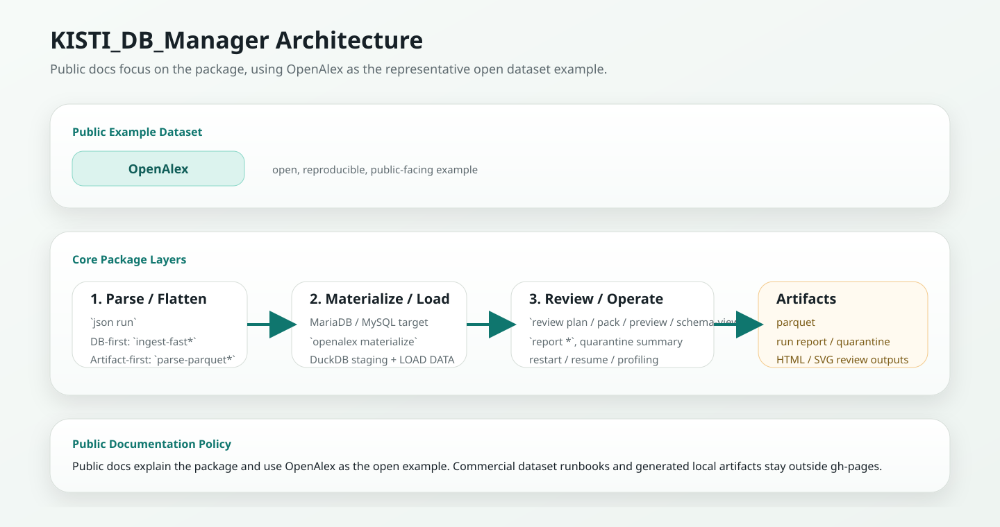

# Package Layout and Architecture

This page explains what the package does before you choose a workflow or change implementation code.

## Core responsibilities

`KISTI_DB_Manager` has four main responsibilities:

1. ingest tabular and nested JSON/XML into MariaDB/MySQL
2. flatten nested sources into base/subtable structures
3. preserve operational artifacts such as parquet, quarantine logs, and run reports
4. generate review outputs that help inspect schema, drift, and restart state

## Architecture at a glance

## Main execution surfaces

### Ingest

- `tabular run`
- `json run`

These are the production paths for create, load, index, and optimize.

### Review

- `review plan`
- `review pack`
- `review preview`
- `review schema-viewer`

These commands are for preflight inspection, schema validation, and artifact generation.

### Operations

- `report *`
- `quarantine summary`
- `parquet *`
- `openalex materialize / benchmark-load / validate-reload`
- `smoke rust-db-load`

These are for profiling, restart, diff, and post-parse materialization.
Source-checkout scripts remain available for maintainer and dataset-specific
workflows, but they are not automatically part of the installed product
contract. See [CLI and Script Boundaries](../reference/script-boundaries.md).

## Architectural split

For large nested sources, the package now supports two operational directions.

### DB-first

- `ingest-fast*`
- goal: finish MariaDB ingest as fast as possible
- best when local artifacts are secondary

### Artifact-first

- `parse-parquet*`
- goal: create canonical parquet artifacts first
- best when local processing, resumability, or downstream reuse matter

## Recommended mental model

Think of the package in three layers:

1. parse / flatten
2. materialize / load
3. review / operate

The public documentation should mostly explain these layers and when to use each one.
OpenAlex is used as the representative public example because the data is open and reproducible.

## Maintainer-facing package layout

The public imports remain stable, but large implementation modules have been split into smaller internal packages.
Use this map when changing code or tracing CLI behavior:

| Area | Current location | Role |
|---|---|---|
| CLI facade | `KISTI_DB_Manager/cli.py` | compatibility entrypoint |
| CLI implementation | `KISTI_DB_Manager/_cli/` | parser registration and command handlers |
| Packaged OpenAlex operations | `KISTI_DB_Manager/openalex_*.py` | reusable OpenAlex materialize, benchmark, validation helpers |
| Parquet operations | `KISTI_DB_Manager/parquet_*.py` | artifact inspection, reload, finalization, replay/repair helpers |
| Review facade | `KISTI_DB_Manager/review.py` | compatibility imports for existing callers |
| Review core | `KISTI_DB_Manager/_review/core.py` | `TableInfo`, DB introspection, table-info merge helpers |
| Review plan | `KISTI_DB_Manager/_review/plan.py` | `review plan` orchestration |
| Review pack | `KISTI_DB_Manager/_review/pack.py` | `review pack` orchestration |
| Review HTML/Markdown | `KISTI_DB_Manager/_review/report_html.py`, `report_markdown.py` | report rendering |
| Schema viewer | `KISTI_DB_Manager/_review/schema_payload.py`, `schema_html.py` | self-contained viewer payload and HTML |
| Schema graph/render | `KISTI_DB_Manager/_review/schema_graph.py`, `schema_render.py` | relationship hints, Mermaid, SVG |
| Pipeline helpers | `KISTI_DB_Manager/_pipeline/` | runtime and JSON source utilities |

`KISTI_DB_Manager.review` and `KISTI_DB_Manager.cli` should stay thin. Add new behavior in the internal modules first, then re-export only when compatibility requires it.
