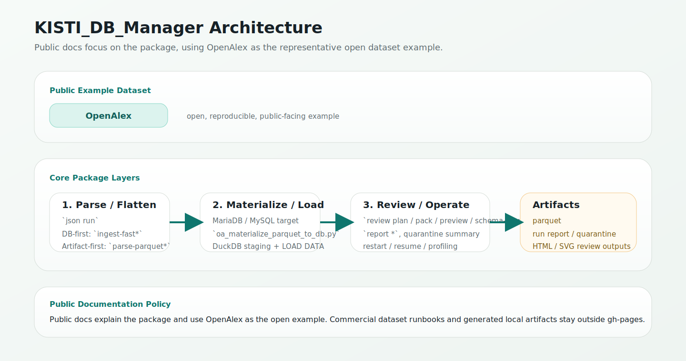

# Chapter 1. Package Overview

This chapter explains what the package does before you choose a workflow.

## Core responsibilities

`KISTI_DB_Manager` has four main responsibilities:

1. ingest tabular and nested JSON/XML into MariaDB/MySQL
2. flatten nested sources into base/subtable structures
3. preserve operational artifacts such as parquet, quarantine logs, and run reports
4. generate review outputs that help inspect schema, drift, and restart state

## Architecture at a glance

## Main execution surfaces

### Ingest

- `tabular run`
- `json run`

These are the production paths for create, load, index, and optimize.

### Review

- `review plan`
- `review pack`
- `review preview`
- `review schema-viewer`

These commands are for preflight inspection, schema validation, and artifact generation.

### Operations

- `report *`
- `quarantine summary`
- helper scripts under `scripts/`

These are for profiling, restart, diff, and post-parse materialization.

## Architectural split

For large nested sources, the package now supports two operational directions.

### DB-first

- `ingest-fast*`
- goal: finish MariaDB ingest as fast as possible
- best when local artifacts are secondary

### Artifact-first

- `parse-parquet*`
- goal: create canonical parquet artifacts first
- best when local processing, resumability, or downstream reuse matter

## Recommended mental model

Think of the package in three layers:

1. parse / flatten
2. materialize / load
3. review / operate

The public documentation should mostly explain these layers and when to use each one.
OpenAlex is used as the representative public example because the data is open and reproducible.
