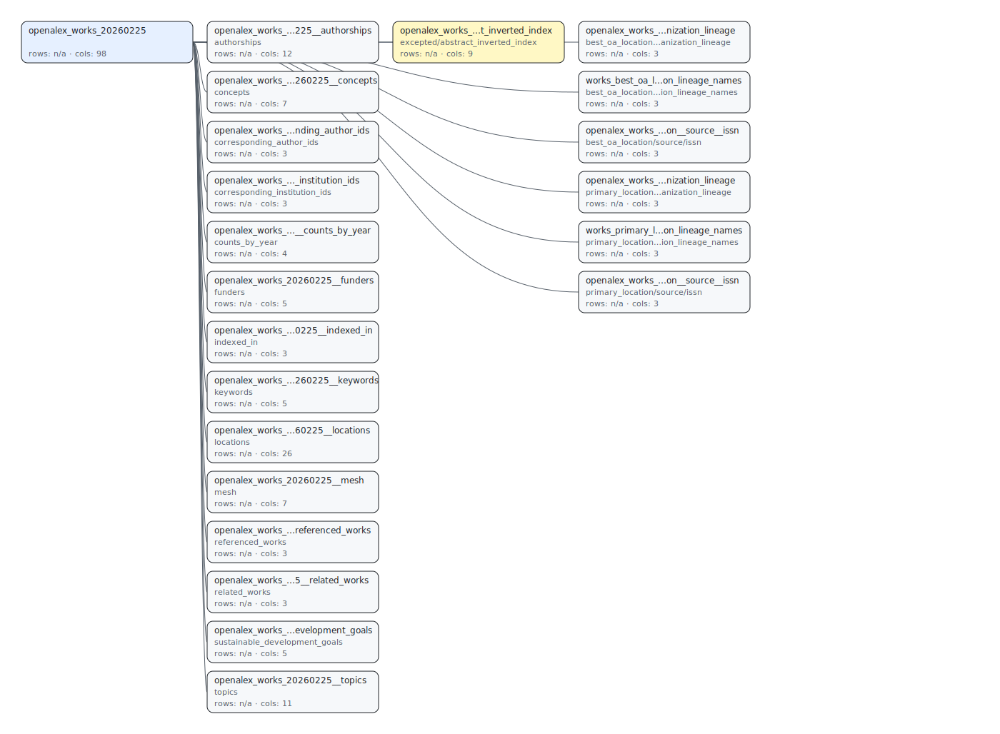

# Chapter 5. Review and Visualization

This chapter covers the package-side review outputs rather than dataset-specific workflows.

## Available review commands

### Review plan

```bash
kisti-db-manager review plan --config path/to/openalex_config.json --out plan_out
```

Use this before a large run when you need predicted schema, DDL, auto-except profiling, and a quick preflight check.

### Review pack

```bash
kisti-db-manager review pack --config path/to/config.json --report run_report.json --out review_out
```

Use this after a run when you need markdown/html/svg outputs with DB introspection and issue overlays.

### Review preview

```bash
kisti-db-manager review preview --config path/to/config.json --out preview_out
```

Use this when you need a small raw-vs-flatten sanity check before committing to a long run.

### Schema viewer

```bash
kisti-db-manager review schema-viewer \
  --config path/to/config.json \
  --report run_report.json \
  --out schema_viewer_out
```

Use this when you want a self-contained HTML schema catalog with:

- sticky navigation
- summary cards
- inline SVG schema
- logical depth groups
- searchable table list
- per-table DDL, columns, indexes, and sample rows

## Public OpenAlex example

The public docs keep a static OpenAlex example because the source dataset is open and reproducible.
This example is generated from the latest OpenAlex review-plan output, so it reflects the current predicted schema path rather than an older DB-backed artifact.

Example schema SVG:

{ width="100%" }

- Download the raw SVG: [`openalex_schema_example.svg`](../assets/openalex_schema_example.svg)
- Generate your own viewer locally with `review schema-viewer` when you need a run-specific artifact.

## Public docs vs generated artifacts

Generated viewer artifacts are not part of the public docs surface by default.
The recommended pattern is:

1. generate viewer locally
2. store the artifact outside `docs/`
3. link it manually only when you explicitly want to publish it

Recommended local artifact convention:

- keep viewer outputs outside `docs/`
- use any ignored local output directory such as `schema_viewer_out/`

## OpenAlex as the public example

OpenAlex is appropriate as a public-facing example because the source data is open and reproducible.
Commercial datasets should stay in internal docs or internal runbooks, not in the public documentation site.
