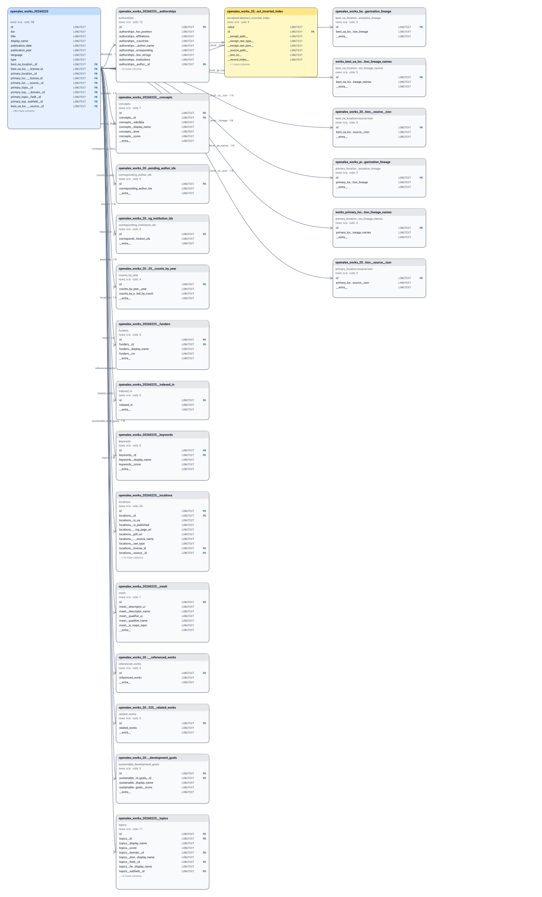

# Chapter 6. Review and Visualization

This chapter covers the package-side review outputs rather than dataset-specific workflows.

## Available review commands

### Review plan

```bash
kisti-db-manager review plan --config path/to/openalex_config.json --out plan_out
```

Use this before a large run when you need predicted schema, DDL, auto-except profiling, and a quick preflight check.

### Review pack

```bash
kisti-db-manager review pack --config path/to/config.json --report run_report.json --out review_out
```

Use this after a run when you need markdown/html/svg outputs with DB introspection and issue overlays.

### Review preview

```bash
kisti-db-manager review preview --config path/to/config.json --out preview_out
```

Use this when you need a small raw-vs-flatten sanity check before committing to a long run.

For OpenAlex-style payloads, the preview now respects `auto_except` and adds an abstract spotlight panel.
That makes `abstract_inverted_index` easy to inspect without exploding the preview into token-level subtables.

### Schema viewer

```bash
kisti-db-manager review schema-viewer \
  --config path/to/config.json \
  --report run_report.json \
  --out schema_viewer_out
```

Use this when you want a self-contained HTML schema catalog with:

- sticky navigation
- summary cards
- inline SVG schema
- logical depth groups
- searchable table list
- parent/child relationship hints and join SQL snippets
- per-table DDL, columns, indexes, and sample rows

## Public OpenAlex examples

The public docs keep static OpenAlex examples because the source dataset is open and reproducible.
Use them to understand what the package produces before you run it on your own data.

### Interactive raw-vs-flatten preview

This example is generated from the latest OpenAlex preview output.
It shows the raw JSON structure, the flattened base/subtable view, union exceptions, and the OpenAlex abstract spotlight for `abstract_inverted_index`.

- Open the interactive preview: [`openalex_preview/preview.html`](../examples/openalex_preview/preview.html)
- Download the preview payload: [`openalex_preview/preview.json`](../examples/openalex_preview/preview.json)

### Predicted schema SVG

This example is generated from the latest OpenAlex review-plan output, so it reflects the current predicted schema path rather than an older DB-backed artifact.
The SVG is table-centric: each box is a split table, with visible columns and lightweight relationship/FK cues.

Example schema SVG:

{ width="100%" }

- Download the raw SVG: [`openalex_schema_example.svg`](../assets/openalex_schema_example.svg)
- Generate your own schema viewer locally with `review schema-viewer` when you need a run-specific artifact.
- Generate your own raw-vs-flatten preview locally with `review preview` when you need a run-specific artifact.

### Regenerating the checked-in OpenAlex schema SVG

The checked-in SVG is a public docs artifact, not an automatic by-product of every OpenAlex run.
When refreshing it, generate into an ignored local directory first and copy only the final SVG into `docs/assets/`.

Use the direct Python call for this maintainer task because the public example should not inherit large-run artifact persistence settings from the saved OpenAlex config.
In particular, set `persist_parquet_files=False`; otherwise a docs refresh can accidentally take the heavy parquet-preservation path.

```bash
python - <<'PY'
from KISTI_DB_Manager.review import generate_review_plan

res = generate_review_plan(
    config_path="runs/<openalex_run>/config.json",
    out_dir="tmp/openalex_schema_refresh",
    formats="md,html,svg,mmd",
    max_records=5000,
    data_overrides={
        "persist_parquet_files": False,
        "persist_tsv_files": False,
        "auto_except": True,
        "auto_except_sample_records": 5000,
        "auto_except_sample_max_sources": 64,
    },
)
print(res["schema_svg"])
PY

cp tmp/openalex_schema_refresh/schema.svg docs/assets/openalex_schema_example.svg
git diff --check
mkdocs build --strict
```

The refreshed SVG should still show `openalex_works_20260225`, the `abstract_inverted_index` excepted table, and the expected table/relationship structure.

## Public docs vs generated artifacts

Generated viewer artifacts are not part of the public docs surface by default.
The recommended pattern is:

1. generate viewer locally
2. store the artifact outside `docs/`
3. link it manually only when you explicitly want to publish it

Recommended local artifact convention:

- keep viewer outputs outside `docs/`
- use any ignored local output directory such as `schema_viewer_out/`

## OpenAlex as the public example

OpenAlex is appropriate as a public-facing example because the source data is open and reproducible.
Commercial datasets should stay in internal docs or internal runbooks, not in the public documentation site.

## Implementation map

Review commands are still imported through `KISTI_DB_Manager.review` for compatibility, but the implementation is split by responsibility:

- `KISTI_DB_Manager/_review/plan.py`: builds pre-load review plans.
- `KISTI_DB_Manager/_review/pack.py`: builds post-run review packs.
- `KISTI_DB_Manager/_review/core.py`: owns `TableInfo`, DB introspection, and table metadata merging.
- `KISTI_DB_Manager/_review/report_markdown.py`: renders `PLAN.md` and `REVIEW.md`.
- `KISTI_DB_Manager/_review/report_html.py`: renders the interactive review-pack HTML.
- `KISTI_DB_Manager/_review/schema_render.py`: renders Mermaid and SVG schema diagrams.
- `KISTI_DB_Manager/_review/schema_payload.py` and `schema_html.py`: build and render the standalone schema viewer.

When updating review behavior, prefer changing the responsible `_review/*` module instead of adding logic to `review.py`.
