# Examples (smoke + previews)

## Run smoke test

Docker (recommended):

```bash
cd examples
docker compose up --build --abort-on-container-exit smoke
docker compose down
```

Host (requires deps + docker):

```bash
bash examples/smoke.sh
```

## Output previews

These are **representative snapshots**. Regenerate locally with the smoke test and check `examples/out/`.

### JSON 20-lists schema diagram

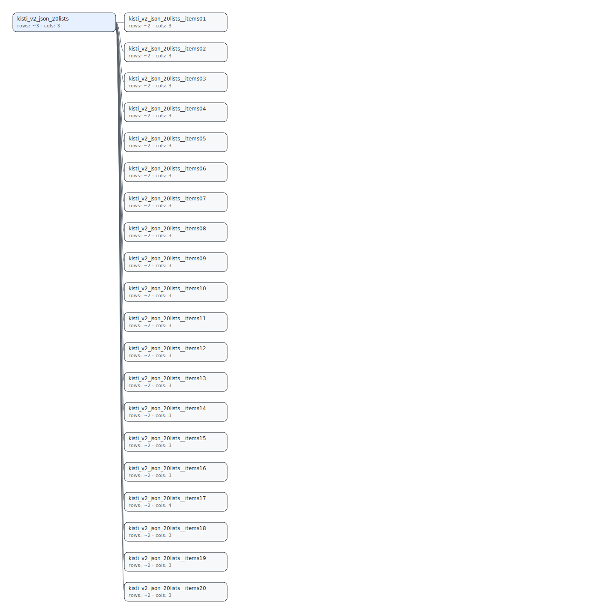

### Review HTML (rendered)

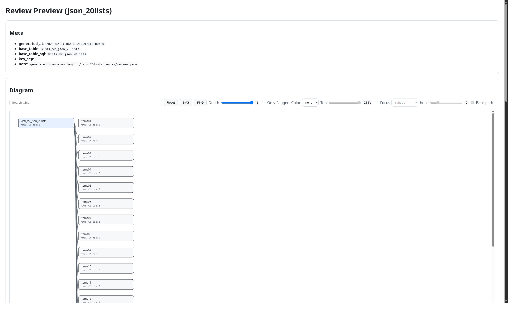

### Review Diff HTML (rendered)

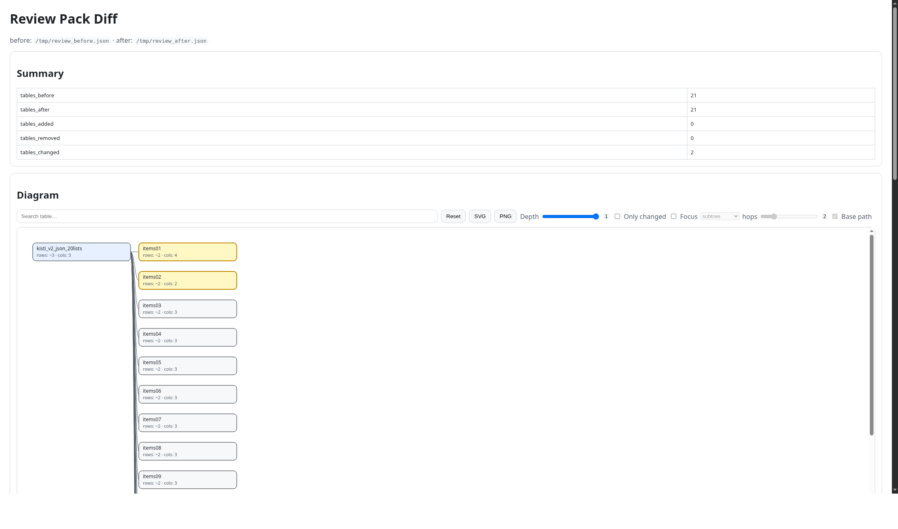

### Raw vs Flatten preview (HTML)

This helps validate whether flattening matches the raw record structure (missing/extra keys), and also provides a **union view**
to spot low-coverage / type-drift branches across sampled records.

```bash
kisti-db-manager review preview --config examples/configs/json_preview_20lists.json --out preview_out
```

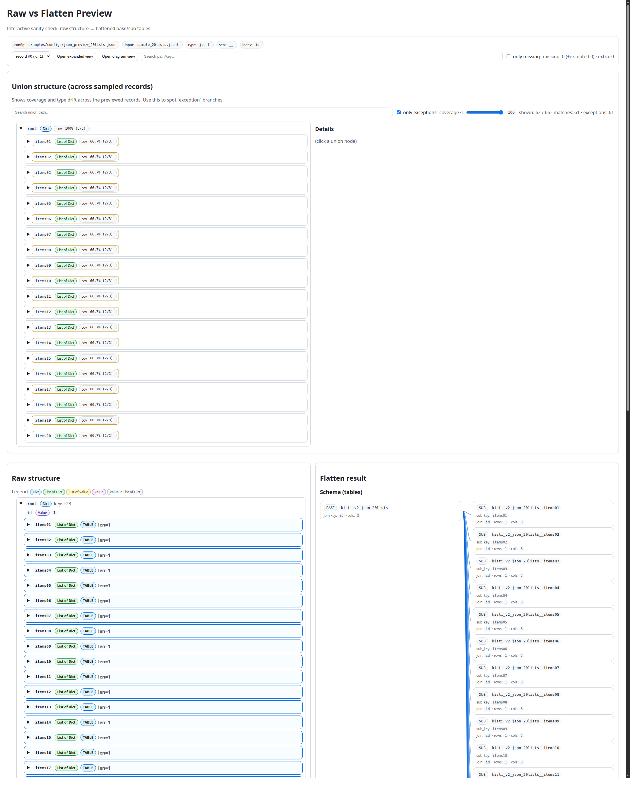

Union structure (scrolled to `#union` in the same page):

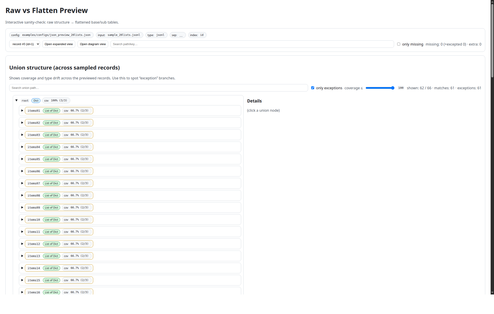

Expanded view (new tab):

```bash
# macOS:
open "preview_out/preview.html?view=expanded&record=0"
# Linux:
xdg-open "preview_out/preview.html?view=expanded&record=0"
```

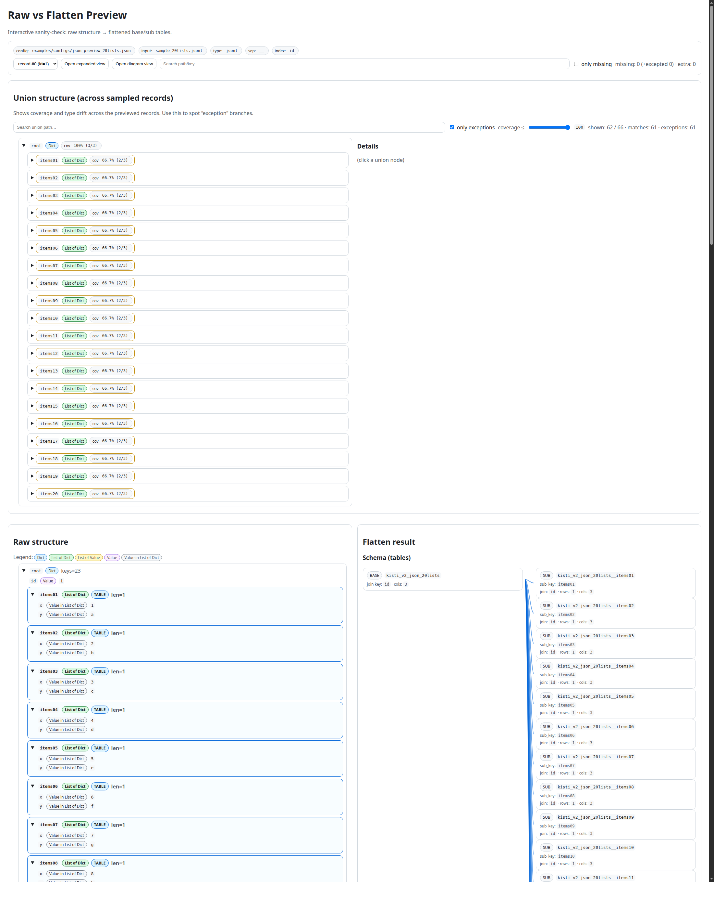

Diagram view (new tab, overview):

```bash
# macOS:
open "preview_out/preview.html?view=diagram&record=0"
# Linux:
xdg-open "preview_out/preview.html?view=diagram&record=0"
```

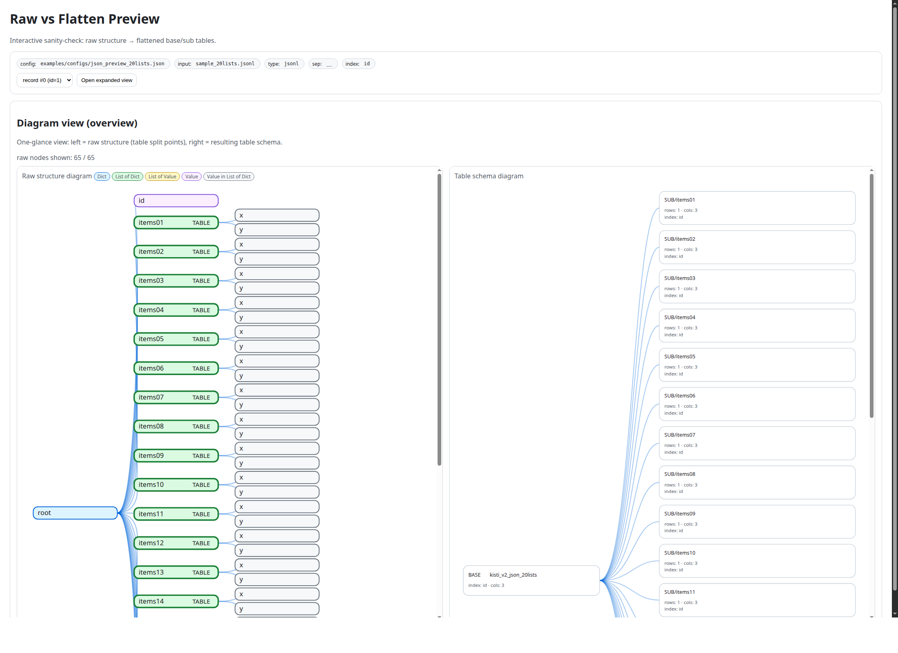

### Raw vs Flatten preview (schema drift / complex)

This is a **synthetic WoS-like JSONL** sample intentionally containing:
- low coverage branches (only some records contain a path)
- type drift (same path is dict vs list vs value, etc.)

```bash
kisti-db-manager review preview --config examples/configs/json_preview_wos_like.json --out preview_out_wos_like --max-records 6
```

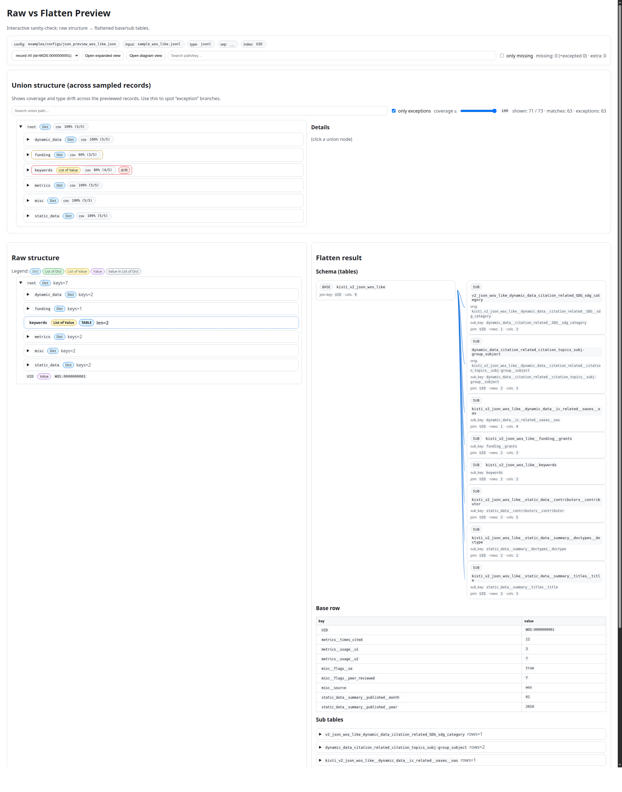

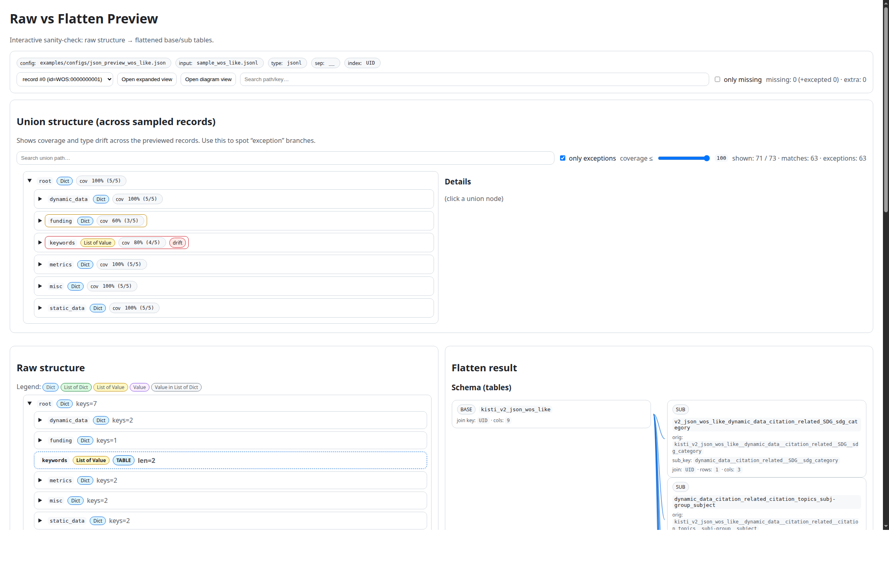

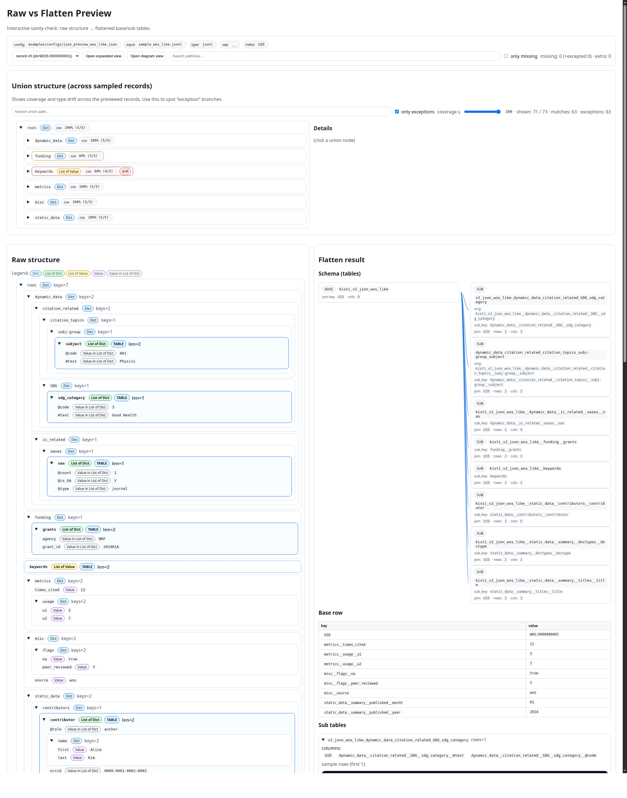

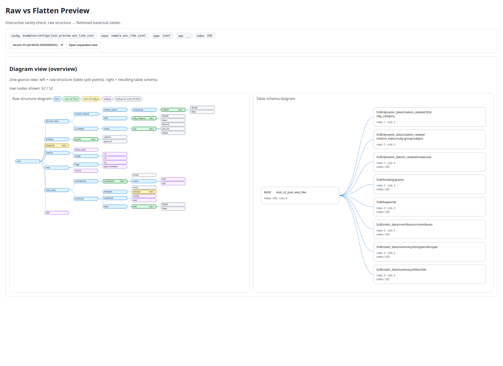

## Data_Sample schema (WoS)

We also ship a real-ish multi-table sample under `Data_Sample/` (repo root).

Generate/update the schema image:

```bash
python3 examples/generate_data_sample_schema.py
```

Result:


